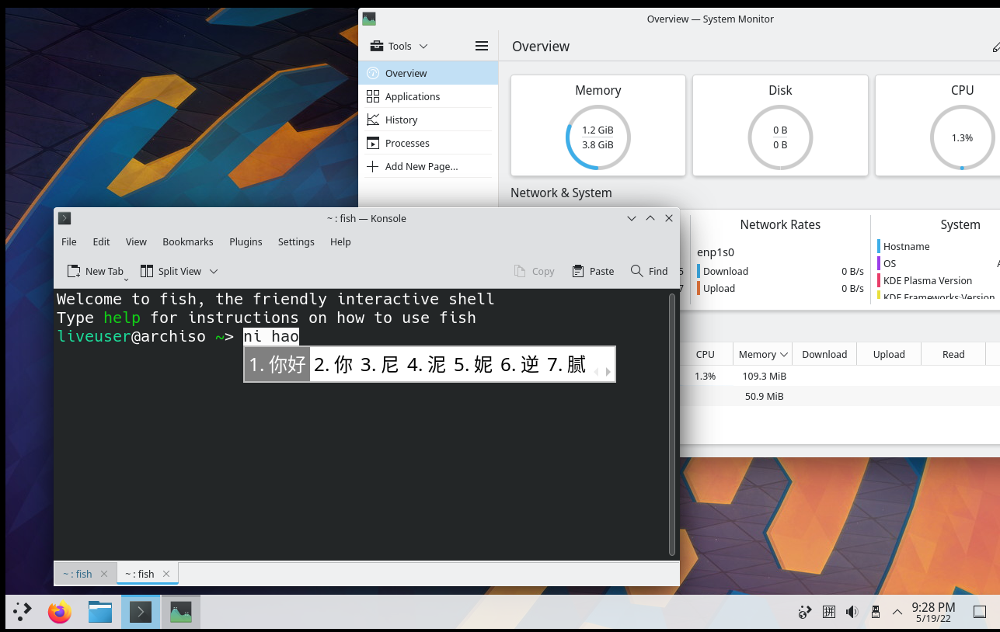

# GorkLiveCD

## Introduction

The Gork Live CD Project aims to create a Arch-based Linux live cd with the minimal size.

We always obey the KISS(Keep It Simple and Stupid)so we will try our best to keep as same as the upstream and won't configure too much.

However,you can still edit the files we published to configure your own Live CD.Please view [archiso page from ArchWiki](https://wiki.archlinux.org/title/Archiso) for details

## Installation

1. You can just download the latest iso from [github release](https://github.com/Molyuu/GorkLiveCD/releases)

2. (**strongly recommend**)You can also clone this repo and use `mkarchiso`to generate the iso.By doing this,your iso will use the latest packages.

Please do like this:

```bash
git clone https://github.com/Molyuu/GorkLiveCD.git
cd GorkLiveCD
sudo mkarchiso -v -w ./ -o .. ./
```

## Details

### Screenshots



### We have added:

- Plasma and Xorg services
- Configured-fcitx5 for Chinese input
- Some repo(`archlinuxcn`)
- Some packages
  - Browsers:`firefox`
  -	[Full packages](./packages.x86_64)

### Know issues

- Fcitx5 need to be configure manually(you have to add `Pinyin` method to it)
- 丑

### Todo list

- [ ] Chinese support(for locale.conf)
- [ ] More packages(such as `libreoffice-fresh`,`wemeet-bin`)(Still **considering**!)
- [ ] Beautify
  - Fonts
  - Theme for Plasma
- [ ] Please tell me

